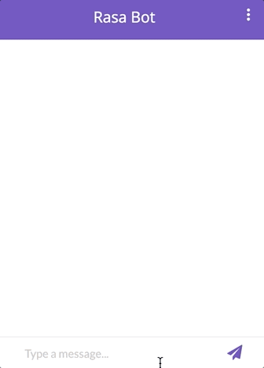
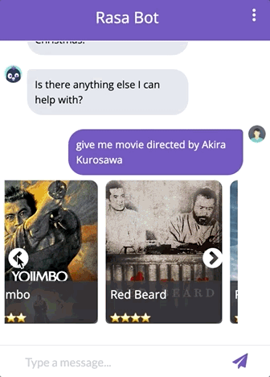

<h1 align="center">
  <a href="docs/bot.svg"></a>
  <br>
  Open-source chatbot with Rasa and the NLP
  <br>
</h1>
<p align="center">
  <a href="#key-features">Key Features</a> •
  <a href="#how-to-use">How To Use</a> •
  <a href="#related">Related</a> •
  <a href="#license">License</a>
</p>
<table>
   <tr>
   <td>
   This project has been developed and conceived only as a learning project and corresponds to a graduation project for the specialty artificial intelligence.
   The goal of the project is to create a movie chatbot using an open source framework <a href="https://rasa.com">Rasa</a>. The bot includes voice recognition and transforms the processed text into a voice as well as a voice into a text.
   </td>
   </tr>
</table>


## Key Features

|                                              User Encouragement                                              |                                                              Movie Description                                                              |                                                          Movie by Director                                                           |                                             Movie Information                                              |
|:------------------------------------------------------------------------------------------------------------:|:-------------------------------------------------------------------------------------------------------------------------------------------:|:------------------------------------------------------------------------------------------------------------------------------------:|:----------------------------------------------------------------------------------------------------------:|
|                                                                                  |                                                                                                                 |                                                                                                          |                                                                                |
| The bot encourages the user with a funny (comedy) movie if the user is in a bad mood ‎ ‎ ‎ ‎ ‎ ‎ ‎ ‎ ‎ ‎ ‎ ‎ | The user can also get a description of the movie sent recently by the bot ‎ ‎ ‎ ‎ ‎ ‎ ‎ ‎ ‎ ‎ ‎ ‎ ‎ ‎ ‎ ‎ ‎ ‎ ‎ ‎ ‎ ‎ ‎ ‎ ‎ ‎ ‎ ‎ ‎ ‎ ‎ ‎ ‎ | Тhe user can also specify the name of the director and the bot will send a dozen films ‎ ‎‎ ‎‎ ‎‎ ‎‎ ‎‎ ‎‎ ‎‎ ‎‎ ‎‎ ‎‎ ‎‎ ‎‎ ‎‎ ‎‎ ‎ | By clicking on the desired movie, the user can send the copied number to get more information‎ ‎ ‎ ‎ ‎ ‎ ‎ |


 

## How to use

1. In terminal 1 (from chatbot):
    ````yml
    rasa run --enable-api --cors "*"
    ````
2. In terminal 2 start server (from chatbot): 
    ````yml
    rasa run actions
    ````
3. Finally, open server page:
    ````yml
    python widget/server.py
    ````
5. For API configuration you need to generate token and add to .env file.
 
## Related

- [TMDB for python](https://github.com/AnthonyBloomer/tmdbv3api): TMDB API for movie requests
- [TMDB API](https://developers.themoviedb.org/3): get started and generate a key

